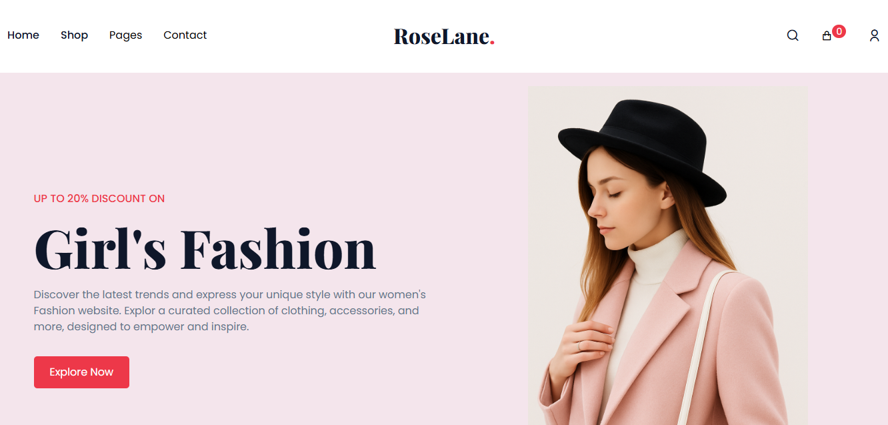

# 🌸 RoseLane

**RoseLane** is a luxury brand landing page designed with a soft pink & white theme. It blends elegant UI with essential e-commerce features like product search, sort, and cart interactions — all built using modern frontend tools.

 <!-- Replace with actual path if different -->

---

## ✨ Features

- 🛍️ Clean and stylish **brand landing page**
- 🔍 Functional **product search and sorting**
- 🛒 Interactive **Add to Cart UI**
- 📱 Fully **responsive design**
- 🎨 Elegant theme using **light pink and white tones**

---

## 🛠️ Tech Stack

- ⚛️ **React** – component-based UI framework
- 🎨 **Tailwind CSS** – utility-first styling
- 💡 **Frontend-only** – no backend/API integration

---

## 🚀 Live link and showcase
[![RoseLane Link]](https://anuj-30.github.io/RoseLane/)

